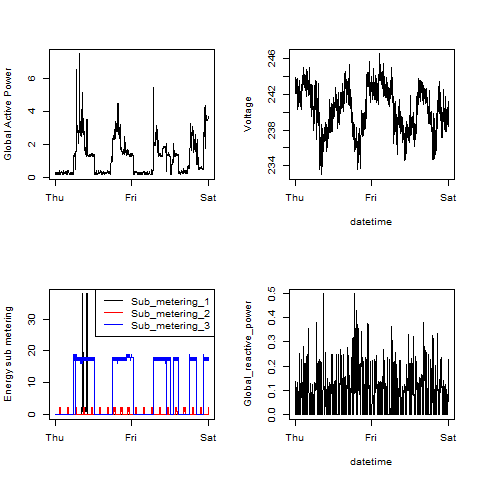

## Introduction

This assignment uses data from the
[UC Irvine Machine Learning Repository](http://archive.ics.uci.edu/ml/)
a popular repository for machine learning datasets. 

Its "Individual household electric power consumption" data set has been 
made available on the [course web site](href="https://d396qusza40orc.cloudfront.net/exdata%2Fdata%2Fhousehold_power_consumption.zip") (20Mb).
It contains measurements of electric power consumption in
one household with a one-minute sampling rate over a period of almost
4 years. Different electrical quantities and some sub-metering values
are available.

The following descriptions of the 9 variables in the dataset are taken from
the [UCI web site](https://archive.ics.uci.edu/ml/datasets/Individual+household+electric+power+consumption)
* *Date*: date in format dd/mm/yyyy
* *Time*: time in format hh:mm:ss
* *Global_active_power*: household global minute-averaged active power (in kilowatt)
* *Global_reactive_power*: household global minute-averaged reactive power (in kilowatt)
* *Voltage*: minute-averaged voltage (in volt)
* *Global_intensity*: household global minute-averaged current intensity (in ampere)
* *Sub_metering_1*: energy sub-metering No. 1 (in watt-hour of active energy). It corresponds to the kitchen, containing mainly a dishwasher, an oven and a microwave (hot plates are not electric but gas powered).
* *Sub_metering_2*: energy sub-metering No. 2 (in watt-hour of active energy). It corresponds to the laundry room, containing a washing-machine, a tumble-drier, a refrigerator and a light.
* *Sub_metering_3*: energy sub-metering No. 3 (in watt-hour of active energy). It corresponds to an electric water-heater and an air-conditioner.

## Loading the data

When loading the dataset into R, consider the following
* the dataset has 2,075,259 rows and 9 columns. First
calculate a rough estimate of how much memory the dataset will require
in memory before reading into R. Make sure your computer has enough
memory (most modern computers should be fine).
* only use data from the dates 2007-02-01 and 2007-02-02. One alternative is to
read the data from just those dates rather than reading in the entire dataset
and subsetting to those dates.
* convert the Date and Time variables to Date/Time classes in R
using the `strptime()` and `as.Date()` functions.
* the missing values are coded as `?`.

## Making Plots

The overall goal here is simply to examine how household energy usage
varies over a 2-day period in February, 2007. Your task is to
reconstruct the following plots below, all of which were constructed
using the base plotting system.

For each plot you should
* construct the plot and save it to a PNG file with a width of 480
pixels and a height of 480 pixels.
* name each of the plot files as `plot1.png`, `plot2.png`, etc.
* create a separate R code file (`plot1.R`, `plot2.R`, etc.) that
constructs the corresponding plot, i.e. code in `plot1.R` constructs
the `plot1.png` plot. Your code file **should include code for reading
the data** so that the plot can be fully reproduced. You should also
include the code that creates the PNG file.

The four plots that you will need to construct are shown below.  
*On the top are the reference plots. On the bottom are the generated plots*

### Plot 1

 

### Plot 2

 

### Plot 3

 

### Plot 4

 
