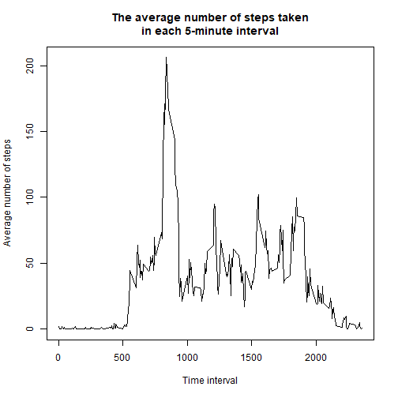

## Loading and preprocessing the data
* load the data
* transform the data into a format suitable for the analysis


```r
unzip("activity.zip")
df <- read.csv("activity.csv")
df <- df[complete.cases(df), ]
summary(df)
```

```
##      steps                date          interval     
##  Min.   :  0.00   2012-10-02:  288   Min.   :   0.0  
##  1st Qu.:  0.00   2012-10-03:  288   1st Qu.: 588.8  
##  Median :  0.00   2012-10-04:  288   Median :1177.5  
##  Mean   : 37.38   2012-10-05:  288   Mean   :1177.5  
##  3rd Qu.: 12.00   2012-10-06:  288   3rd Qu.:1766.2  
##  Max.   :806.00   2012-10-07:  288   Max.   :2355.0  
##                   (Other)   :13536
```

## What is mean total number of steps taken per day?

* Calculate the total number of steps taken per day


```r
steps_per_day <- aggregate(steps ~ date, df, sum)
steps_per_day
```

```
##          date steps
## 1  2012-10-02   126
## 2  2012-10-03 11352
## 3  2012-10-04 12116
## 4  2012-10-05 13294
## 5  2012-10-06 15420
## 6  2012-10-07 11015
## 7  2012-10-09 12811
## 8  2012-10-10  9900
## 9  2012-10-11 10304
## 10 2012-10-12 17382
## 11 2012-10-13 12426
## 12 2012-10-14 15098
## 13 2012-10-15 10139
## 14 2012-10-16 15084
## 15 2012-10-17 13452
## 16 2012-10-18 10056
## 17 2012-10-19 11829
## 18 2012-10-20 10395
## 19 2012-10-21  8821
## 20 2012-10-22 13460
## 21 2012-10-23  8918
## 22 2012-10-24  8355
## 23 2012-10-25  2492
## 24 2012-10-26  6778
## 25 2012-10-27 10119
## 26 2012-10-28 11458
## 27 2012-10-29  5018
## 28 2012-10-30  9819
## 29 2012-10-31 15414
## 30 2012-11-02 10600
## 31 2012-11-03 10571
## 32 2012-11-05 10439
## 33 2012-11-06  8334
## 34 2012-11-07 12883
## 35 2012-11-08  3219
## 36 2012-11-11 12608
## 37 2012-11-12 10765
## 38 2012-11-13  7336
## 39 2012-11-15    41
## 40 2012-11-16  5441
## 41 2012-11-17 14339
## 42 2012-11-18 15110
## 43 2012-11-19  8841
## 44 2012-11-20  4472
## 45 2012-11-21 12787
## 46 2012-11-22 20427
## 47 2012-11-23 21194
## 48 2012-11-24 14478
## 49 2012-11-25 11834
## 50 2012-11-26 11162
## 51 2012-11-27 13646
## 52 2012-11-28 10183
## 53 2012-11-29  7047
```

* Make a histogram of the total number of steps taken each day


```r
hist(
    steps_per_day$steps,
    breaks=5,
    xlab="Number of steps taken in a day", 
    main="Histogram of the total number of steps taken each day")
```


* Calculate and report the mean and median of the total number of steps
  taken per day


```r
m1 <- round(mean(steps_per_day$steps), 2)
m2 <- round(median(steps_per_day$steps), 2)
print(paste("The mean and median number of steps taken per day:", m1, m2))
```

```
## [1] "The mean and median number of steps taken per day: 10766.19 10765"
```

## What is the average daily activity pattern?

* Make a time series plot of the 5-minute interval (x-axis) and the average
  number of steps taken, averaged across all days (y-axis)


```r
mean_activity <- aggregate(steps ~ interval, df, mean)

plot(
    mean_activity$interval, 
    mean_activity$steps, 
    type="l",
    xlab="Time interval",
    ylab="Average number of steps",
    main="The average number of steps taken\nin each 5-minute interval")
```



* Which 5-minute interval, on average across all the days in the dataset, 
contains the maximum number of steps?


```r
max_activity_interval <- mean_activity[which.max(mean_activity$steps),]
print(paste(
    "The interval with the maximum average number of steps across all days:",
    "interval =", max_activity_interval$interval,
    "steps =", round(max_activity_interval$steps, 0)))
```

```
## [1] "The interval with the maximum average number of steps across all days: interval = 835 steps = 206"
```

## Imputing missing values

* Calculate and report the total number of missing values in the dataset
    * the only variable containing missing values is *steps*


```r
ndf <- read.csv('activity.csv', header=TRUE)
print(paste(
    "The number of entries with missing values is:", sum(is.na(ndf$steps))))
```

```
## [1] "The number of entries with missing values is: 2304"
```

* Create a new dataset that is equal to the original dataset but with the 
  missing data filled in
    * devise a strategy for filling in all of the missing values in the dataset
    * the strategy does not need to be sophisticated
    * for example, you could use the mean/median for that day, 
      or the mean for that 5-minute interval, etc


```r
activity <- aggregate(steps ~ interval, ndf, mean)

nchanges <- 0
for (i in 1:nrow(ndf)){
    if (is.na(ndf$steps[i])){
        cinterval <- ndf$interval[i]
        ndf$steps[i] <- round(activity$steps[activity$interval==cinterval], 2)
        nchanges <- nchanges + 1
    }
}
print(paste("Updated", nchanges, "missing values in the 'steps' variable"))
```

```
## [1] "Updated 2304 missing values in the 'steps' variable"
```

* Make a histogram of the total number of steps taken each day 


```r
n_steps_per_day <- aggregate(steps ~ date, ndf, sum)

hist(
    n_steps_per_day$steps,
    breaks=5,
    xlab="Number of steps taken in a day", 
    main="Histogram of the total number of steps taken each day")
```


* Calculate and report the mean and median total number of steps taken per day.


```r
nm1 <- round(mean(n_steps_per_day$steps), 2)
nm2 <- round(median(n_steps_per_day$steps), 2)
print(paste("The mean and median number of steps taken per day:", nm1, nm2))
```

```
## [1] "The mean and median number of steps taken per day: 10766.18 10766.13"
```

* Do these values differ from the estimates from the 1st part of the assignment? 


```r
d1 <- round(m1 - nm1, 2)
d2 <- round(m2 - nm2, 2)
print(paste(
    "Difference in mean and median estimates after imputting missing values", 
    d1, d2))
```

```
## [1] "Difference in mean and median estimates after imputting missing values 0.01 -1.13"
```

* What is the impact of imputing missing data on the estimates 
  of the total daily number of steps?


```r
df <- read.csv('activity.csv', header=TRUE)
steps_per_day <- aggregate(steps ~ date, df, sum, na.action=na.pass)

differences <- data.frame(
    referenceSteps=steps_per_day$steps, 
    updatedSteps=n_steps_per_day$steps,
    differenceSteps=n_steps_per_day$steps - steps_per_day$steps)

print(differences)
```

```
##    referenceSteps updatedSteps differenceSteps
## 1              NA     10766.13              NA
## 2             126       126.00               0
## 3           11352     11352.00               0
## 4           12116     12116.00               0
## 5           13294     13294.00               0
## 6           15420     15420.00               0
## 7           11015     11015.00               0
## 8              NA     10766.13              NA
## 9           12811     12811.00               0
## 10           9900      9900.00               0
## 11          10304     10304.00               0
## 12          17382     17382.00               0
## 13          12426     12426.00               0
## 14          15098     15098.00               0
## 15          10139     10139.00               0
## 16          15084     15084.00               0
## 17          13452     13452.00               0
## 18          10056     10056.00               0
## 19          11829     11829.00               0
## 20          10395     10395.00               0
## 21           8821      8821.00               0
## 22          13460     13460.00               0
## 23           8918      8918.00               0
## 24           8355      8355.00               0
## 25           2492      2492.00               0
## 26           6778      6778.00               0
## 27          10119     10119.00               0
## 28          11458     11458.00               0
## 29           5018      5018.00               0
## 30           9819      9819.00               0
## 31          15414     15414.00               0
## 32             NA     10766.13              NA
## 33          10600     10600.00               0
## 34          10571     10571.00               0
## 35             NA     10766.13              NA
## 36          10439     10439.00               0
## 37           8334      8334.00               0
## 38          12883     12883.00               0
## 39           3219      3219.00               0
## 40             NA     10766.13              NA
## 41             NA     10766.13              NA
## 42          12608     12608.00               0
## 43          10765     10765.00               0
## 44           7336      7336.00               0
## 45             NA     10766.13              NA
## 46             41        41.00               0
## 47           5441      5441.00               0
## 48          14339     14339.00               0
## 49          15110     15110.00               0
## 50           8841      8841.00               0
## 51           4472      4472.00               0
## 52          12787     12787.00               0
## 53          20427     20427.00               0
## 54          21194     21194.00               0
## 55          14478     14478.00               0
## 56          11834     11834.00               0
## 57          11162     11162.00               0
## 58          13646     13646.00               0
## 59          10183     10183.00               0
## 60           7047      7047.00               0
## 61             NA     10766.13              NA
```

## Are there differences in activity patterns between weekdays and weekends?

* Create a new factor variable in the dataset with two levels -
  "weekday" and "weekend" indicating whether a given date
  is a weekday or weekend day


```r
get_day_type <- function(given_date){
    day_name <- weekdays(as.Date(given_date))
    day_type <- NA
    if (day_name %in% c("Saturday", "Sunday")){
        day_type <- "weekend"
    }
    else{
        day_type <- "weekday"
    }
    day_type
}

ndf$daytype <- as.factor(sapply(ndf$date, get_day_type))

print(table(weekdays(as.Date(ndf$date))))
```

```
## 
##    Friday    Monday  Saturday    Sunday  Thursday   Tuesday Wednesday 
##      2592      2592      2304      2304      2592      2592      2592
```

```r
print(summary(ndf$daytype))
```

```
## weekday weekend 
##   12960    4608
```

* Make a panel plot containing a time series plot of the 5-minute interval 
  (x-axis) and the average number of steps taken, 
  averaged across all weekday days or weekend days (y-axis).


```r
library(ggplot2)
average_steps_per_interval <- aggregate(steps ~ interval + daytype, ndf, mean)

ggplot(data=average_steps_per_interval, aes(x=interval, y=steps)) + 
    geom_line(aes(color=daytype)) +
    labs(x="Interval", y="Average number of steps") +
    facet_wrap( ~ daytype, nrow = 2) +
    theme_classic() +
    theme(
        legend.position = "none", 
        strip.background=element_rect(fill="bisque"))
```


