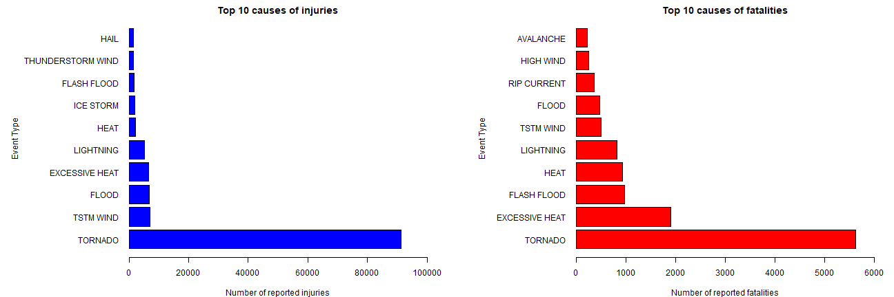
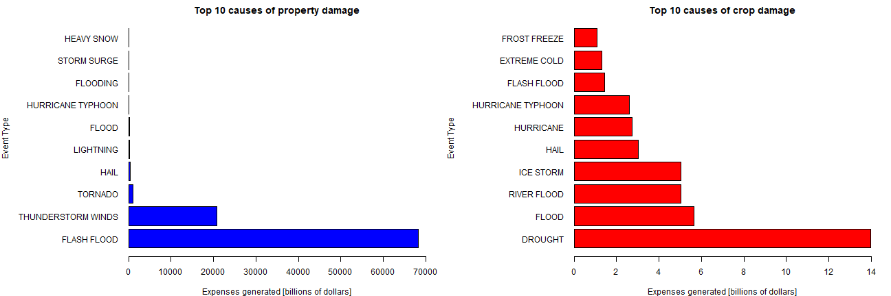

# Health and economic impact of weather events

## Introduction

Storms and other severe weather events can cause both public health and economic problems for communities and municipalities.
Many severe events can result in fatalities, injuries, and property damage, and preventing such outcomes to the extent possible is a key concern.

This project involves exploring the U.S. National Oceanic and Atmospheric Administration's (NOAA) storm database.
This database tracks characteristics of major storms and weather events in the United States,
including when and where they occur, as well as estimates of any fatalities, injuries, and property damage.

## Synopsis

The goal of this analysis is to identify the health and economic impact of weather events.

Two data processing steps are necessary for this analysis:
* cleaning the event names
* reconstructing the complete values of property damage and crop damage.

The analysis reveals that the most dangerous event for the population health are the tornados, causing 37% of the fatalities.
They are followed by the event of excessive heat which is causing 13% of fatalities.

The analysis also reveals that the event causing the greatest economic consequences are the flash floods, generating 75% of the damage costs.
They are followed by the event of thunderstorm winds which is generating 23% of expenses.

The most severe weather event with respect to crop damage is the drought.
It generates 28% of the damage costs.

## Details of the analysis

### Data description

The data is presented under the format of a csv file compressed via the bzip2 algorithm.
The achive can be downloaded from the [course](https://d396qusza40orc.cloudfront.net/repdata%2Fdata%2FStormData.csv.bz2) web site.

The documentation is available at:
* National Weather Service [Storm Data Documentation](https://d396qusza40orc.cloudfront.net/repdata%2Fpeer2_doc%2Fpd01016005curr.pdf)
* National Climatic Data Center Storm Events [FAQ](https://d396qusza40orc.cloudfront.net/repdata%2Fpeer2_doc%2FNCDC%20Storm%20Events-FAQ%20Page.pdf)

The events in the database start in the year 1950 and end in November 2011.
In the earlier years of the database there are generally fewer events recorded,
most likely due to a lack of good records.
More recent years should be considered more complete.

### Goal of analysis

The goal is to explore the NOAA Storm Database and answer some basic questions about severe weather events:
* across the United States, which types of events are most harmful with respect to population health?
* across the United States, which types of events have the greatest economic consequences?

### Data processing

* download the archive and read the data


```r
url <- "https://d396qusza40orc.cloudfront.net/repdata%2Fdata%2FStormData.csv.bz2"
archive <- "StormData.csv.bz2"

if ( !file.exists(archive)){
    download.file(url, archive)
}

data <- read.csv(bzfile(archive), header=TRUE)
```

* inspect the data


```r
str(data)
```

```
## 'data.frame':	902297 obs. of  37 variables:
##  $ STATE__   : num  1 1 1 1 1 1 1 1 1 1 ...
##  $ BGN_DATE  : Factor w/ 16335 levels "1/1/1966 0:00:00",..: 6523 6523 4242 11116 2224 2224 2260 383 3980 3980 ...
##  $ BGN_TIME  : Factor w/ 3608 levels "00:00:00 AM",..: 272 287 2705 1683 2584 3186 242 1683 3186 3186 ...
##  $ TIME_ZONE : Factor w/ 22 levels "ADT","AKS","AST",..: 7 7 7 7 7 7 7 7 7 7 ...
##  $ COUNTY    : num  97 3 57 89 43 77 9 123 125 57 ...
##  $ COUNTYNAME: Factor w/ 29601 levels "","5NM E OF MACKINAC BRIDGE TO PRESQUE ISLE LT MI",..: 13513 1873 4598 10592 4372 10094 1973 23873 24418 4598 ...
##  $ STATE     : Factor w/ 72 levels "AK","AL","AM",..: 2 2 2 2 2 2 2 2 2 2 ...
##  $ EVTYPE    : Factor w/ 985 levels "   HIGH SURF ADVISORY",..: 834 834 834 834 834 834 834 834 834 834 ...
##  $ BGN_RANGE : num  0 0 0 0 0 0 0 0 0 0 ...
##  $ BGN_AZI   : Factor w/ 35 levels "","  N"," NW",..: 1 1 1 1 1 1 1 1 1 1 ...
##  $ BGN_LOCATI: Factor w/ 54429 levels "","- 1 N Albion",..: 1 1 1 1 1 1 1 1 1 1 ...
##  $ END_DATE  : Factor w/ 6663 levels "","1/1/1993 0:00:00",..: 1 1 1 1 1 1 1 1 1 1 ...
##  $ END_TIME  : Factor w/ 3647 levels ""," 0900CST",..: 1 1 1 1 1 1 1 1 1 1 ...
##  $ COUNTY_END: num  0 0 0 0 0 0 0 0 0 0 ...
##  $ COUNTYENDN: logi  NA NA NA NA NA NA ...
##  $ END_RANGE : num  0 0 0 0 0 0 0 0 0 0 ...
##  $ END_AZI   : Factor w/ 24 levels "","E","ENE","ESE",..: 1 1 1 1 1 1 1 1 1 1 ...
##  $ END_LOCATI: Factor w/ 34506 levels "","- .5 NNW",..: 1 1 1 1 1 1 1 1 1 1 ...
##  $ LENGTH    : num  14 2 0.1 0 0 1.5 1.5 0 3.3 2.3 ...
##  $ WIDTH     : num  100 150 123 100 150 177 33 33 100 100 ...
##  $ F         : int  3 2 2 2 2 2 2 1 3 3 ...
##  $ MAG       : num  0 0 0 0 0 0 0 0 0 0 ...
##  $ FATALITIES: num  0 0 0 0 0 0 0 0 1 0 ...
##  $ INJURIES  : num  15 0 2 2 2 6 1 0 14 0 ...
##  $ PROPDMG   : num  25 2.5 25 2.5 2.5 2.5 2.5 2.5 25 25 ...
##  $ PROPDMGEXP: Factor w/ 19 levels "","-","?","+",..: 17 17 17 17 17 17 17 17 17 17 ...
##  $ CROPDMG   : num  0 0 0 0 0 0 0 0 0 0 ...
##  $ CROPDMGEXP: Factor w/ 9 levels "","?","0","2",..: 1 1 1 1 1 1 1 1 1 1 ...
##  $ WFO       : Factor w/ 542 levels ""," CI","$AC",..: 1 1 1 1 1 1 1 1 1 1 ...
##  $ STATEOFFIC: Factor w/ 250 levels "","ALABAMA, Central",..: 1 1 1 1 1 1 1 1 1 1 ...
##  $ ZONENAMES : Factor w/ 25112 levels "","                                                                                                               "| __truncated__,..: 1 1 1 1 1 1 1 1 1 1 ...
##  $ LATITUDE  : num  3040 3042 3340 3458 3412 ...
##  $ LONGITUDE : num  8812 8755 8742 8626 8642 ...
##  $ LATITUDE_E: num  3051 0 0 0 0 ...
##  $ LONGITUDE_: num  8806 0 0 0 0 ...
##  $ REMARKS   : Factor w/ 436781 levels "","-2 at Deer Park\n",..: 1 1 1 1 1 1 1 1 1 1 ...
##  $ REFNUM    : num  1 2 3 4 5 6 7 8 9 10 ...
```

* select only the variables that are useful for the analysis
    * event type
    * population health: fatalities and injuries
    * economic consequences: property damage and crop damage
    

```r
data <- data[, c(8, 23, 24, 25, 26, 27, 28)]
str(data)
```

```
## 'data.frame':	902297 obs. of  7 variables:
##  $ EVTYPE    : Factor w/ 985 levels "   HIGH SURF ADVISORY",..: 834 834 834 834 834 834 834 834 834 834 ...
##  $ FATALITIES: num  0 0 0 0 0 0 0 0 1 0 ...
##  $ INJURIES  : num  15 0 2 2 2 6 1 0 14 0 ...
##  $ PROPDMG   : num  25 2.5 25 2.5 2.5 2.5 2.5 2.5 25 25 ...
##  $ PROPDMGEXP: Factor w/ 19 levels "","-","?","+",..: 17 17 17 17 17 17 17 17 17 17 ...
##  $ CROPDMG   : num  0 0 0 0 0 0 0 0 0 0 ...
##  $ CROPDMGEXP: Factor w/ 9 levels "","?","0","2",..: 1 1 1 1 1 1 1 1 1 1 ...
```

* clean the event names
    * upercase the name of events
    * replace all punctuation marks with spaces
    * trim leading and trailing whitespaces


```r
events <- toupper(data$EVTYPE)
events <- gsub("[[:punct:]]", " ", events)
events <- gsub("^[[:space:]]+|[[:space:]]+$", "", events)
print(paste(
    "Passed from", length(unique(data$EVTYPE)), 
    "to", length(unique(events)), "unique event names"))
```

```
## [1] "Passed from 985 to 856 unique event names"
```

```r
data$EVTYPE <- events
```

* reconstruct the property damage and crop damage values
    * combine *PROPDMG* (floating value) and *PROPDMGEXP* (exponent) variables
    * combine *CROPDMG* (floating value) and *CROPDMGEXP* (exponent) variables


```r
compose_value <- function(exp){
    if (exp %in% c('h', 'H'))
        return(10 ^ 2)
    else if (exp %in% c('k', 'K'))
        return(10 ^ 3)
    else if (exp %in% c('m', 'M'))
        return(10 ^ 6)
    else if (exp %in% c('b', 'B'))
        return(10 ^ 9)
    else if (!is.na(as.numeric(exp)))
        return(10 ^ as.numeric(exp))
    else if (exp %in% c('', '-', '?', '+'))
        return(1)
    NA
}

data$PROPDMG <- data$PROPDMG * sapply(data$PROPDMGEXP, compose_value)
data$CROPDMG <- data$CROPDMG * sapply(data$CROPDMGEXP, compose_value)
data <- data[, c(1, 2, 3, 4, 6)]

str(data)
```

```
## 'data.frame':	902297 obs. of  5 variables:
##  $ EVTYPE    : chr  "TORNADO" "TORNADO" "TORNADO" "TORNADO" ...
##  $ FATALITIES: num  0 0 0 0 0 0 0 0 1 0 ...
##  $ INJURIES  : num  15 0 2 2 2 6 1 0 14 0 ...
##  $ PROPDMG   : num  25000 2500 25000 2500 2500 2500 2500 2500 25000 25000 ...
##  $ CROPDMG   : num  0 0 0 0 0 0 0 0 0 0 ...
```

### Explore the consequences of severe weather events

* identify which types of events are most harmful with respect to population health?

    * inspect the injuries counts with respect to the event types

    
    ```r
    hdata1 <- aggregate(INJURIES ~ EVTYPE, data, sum)
    hdata1 <- hdata1[order(-hdata1$INJURIES),]
    print("The top 10 events that caused the most number of injuries:")
    ```
    
    ```
    ## [1] "The top 10 events that caused the most number of injuries:"
    ```
    
    ```r
    head(hdata1, 10)
    ```
    
    ```
    ##                EVTYPE INJURIES
    ## 724           TORNADO    91346
    ## 745         TSTM WIND     6957
    ## 145             FLOOD     6789
    ## 108    EXCESSIVE HEAT     6525
    ## 397         LIGHTNING     5230
    ## 228              HEAT     2100
    ## 369         ICE STORM     1975
    ## 130       FLASH FLOOD     1777
    ## 657 THUNDERSTORM WIND     1488
    ## 199              HAIL     1361
    ```

    * inspect the fatalities counts with respect to the event types

    
    ```r
    hdata2 <- aggregate(FATALITIES ~ EVTYPE, data, sum)
    hdata2 <- hdata2[order(-hdata2$FATALITIES),]
    print("The top 10 events that caused the most number of fatalities:")
    ```
    
    ```
    ## [1] "The top 10 events that caused the most number of fatalities:"
    ```
    
    ```r
    head(hdata2, 10)
    ```
    
    ```
    ##             EVTYPE FATALITIES
    ## 724        TORNADO       5633
    ## 108 EXCESSIVE HEAT       1903
    ## 130    FLASH FLOOD        978
    ## 228           HEAT        937
    ## 397      LIGHTNING        817
    ## 745      TSTM WIND        504
    ## 145          FLOOD        470
    ## 501    RIP CURRENT        368
    ## 302      HIGH WIND        248
    ## 11       AVALANCHE        224
    ```

    * inspect percentages of most dangerous events

    
    ```r
    total_fatalities <- sum(hdata2$FATALITIES)
    
    for (event in head(hdata2$EVTYPE, 3)){
        n <- sum(hdata2[which(hdata2$EVTYPE == event), ]$FATALITIES)
        p <- round(n / total_fatalities * 100, 2)
        print(paste("The", event, "causes", p, "% of fatalities"))
    }    
    ```
    
    ```
    ## [1] "The TORNADO causes 37.19 % of fatalities"
    ## [1] "The EXCESSIVE HEAT causes 12.57 % of fatalities"
    ## [1] "The FLASH FLOOD causes 6.46 % of fatalities"
    ```

    * inspect the injuries and fatalities counts with a plot 

    
    ```r
    hdata1 <- head(hdata1, 10)
    hdata2 <- head(hdata2, 10)
    ```

    
    ```r
    par(mfrow=c(1:2))
    par(mar=c(4, 13, 2, 2))
    options(scipen = 50) 
    
    barplot(
        hdata1$INJURIES, 
        names.arg=hdata1$EVTYPE, 
        horiz=TRUE,
        las=1,
        col="blue",
        xlim=c(0, 100000),
        xlab="Number of reported injuries",
        ylab="Event Type\n\n\n\n\n\n\n\n",
        main="Top 10 causes of injuries") 
    barplot(
        hdata2$FATALITIES, 
        names.arg=hdata2$EVTYPE, 
        horiz=TRUE,
        las=1,
        col="red", 
        xlim=c(0, 6000),
        xlab="Number of reported fatalities",
        ylab="Event Type\n\n\n\n\n\n",
        main="Top 10 causes of fatalities") 
    ```
    
    


* identify which types of events have the greatest economic consequences?

    * inspect the property damage with respect to the event types

    
    ```r
    ecdata1 <- aggregate(PROPDMG ~ EVTYPE, data, sum)
    ecdata1 <- ecdata1[order(-ecdata1$PROPDMG),]
    print("The top 10 events that caused the greatest property damage:")
    ```
    
    ```
    ## [1] "The top 10 events that caused the greatest property damage:"
    ```
    
    ```r
    head(ecdata1, 10)
    ```
    
    ```
    ##                 EVTYPE        PROPDMG
    ## 130        FLASH FLOOD 68202367513580
    ## 681 THUNDERSTORM WINDS 20865316771860
    ## 724            TORNADO  1078951110510
    ## 199               HAIL   315755837790
    ## 397          LIGHTNING   172943309310
    ## 145              FLOOD   144657709870
    ## 353  HURRICANE TYPHOON    69305840000
    ## 157           FLOODING    59208255000
    ## 571        STORM SURGE    43323536000
    ## 258         HEAVY SNOW    17932589140
    ```

    * inspect the crop damage with respect to the event types

    
    ```r
    ecdata2 <- aggregate(CROPDMG ~ EVTYPE, data, sum)
    ecdata2 <- ecdata2[order(-ecdata2$CROPDMG),]
    print("The top 10 events that caused the greatest crop damage:")
    ```
    
    ```
    ## [1] "The top 10 events that caused the greatest crop damage:"
    ```
    
    ```r
    head(ecdata2, 10)
    ```
    
    ```
    ##                EVTYPE     CROPDMG
    ## 76            DROUGHT 13972566000
    ## 145             FLOOD  5661968450
    ## 505       RIVER FLOOD  5029459000
    ## 369         ICE STORM  5022113500
    ## 199              HAIL  3025974480
    ## 344         HURRICANE  2741910000
    ## 353 HURRICANE TYPHOON  2607872800
    ## 130       FLASH FLOOD  1421317100
    ## 117      EXTREME COLD  1312973000
    ## 176      FROST FREEZE  1094186000
    ```

    * inspect percentages of most property damaging events

    
    ```r
    total_expenses <- sum(ecdata1$PROPDMG)
    
    for (event in head(ecdata1$EVTYPE, 3)){
        n <- sum(ecdata1[which(ecdata1$EVTYPE == event), ]$PROPDMG)
        p <- round(n / total_expenses * 100, 2)
        print(paste("The", event, "causes", p, "% of expenses"))
    }    
    ```
    
    ```
    ## [1] "The FLASH FLOOD causes 74.91 % of expenses"
    ## [1] "The THUNDERSTORM WINDS causes 22.92 % of expenses"
    ## [1] "The TORNADO causes 1.19 % of expenses"
    ```
    
    
    * inspect percentages of most crop damaging events

    
    ```r
    total_expenses <- sum(ecdata2$CROPDMG)
    
    for (event in head(ecdata2$EVTYPE, 3)){
        n <- sum(ecdata2[which(ecdata2$EVTYPE == event), ]$CROPDMG)
        p <- round(n / total_expenses * 100, 2)
        print(paste("The", event, "causes", p, "% of expenses"))
    }    
    ```
    
    ```
    ## [1] "The DROUGHT causes 28.45 % of expenses"
    ## [1] "The FLOOD causes 11.53 % of expenses"
    ## [1] "The RIVER FLOOD causes 10.24 % of expenses"
    ```

    * inspect the economic consequences with a plot 

    
    ```r
    ecdata1 <- head(ecdata1, 10)
    ecdata2 <- head(ecdata2, 10)
    ecdata1$PROPDMG <- ecdata1$PROPDMG / (10^9)
    ecdata2$CROPDMG <- ecdata2$CROPDMG / (10^9)
    ```

    
    ```r
    par(mfrow=c(1:2))
    par(mar=c(4, 13, 2, 2))
    options(scipen = 3) 
    
    barplot(
        ecdata1$PROPDMG, 
        names.arg=ecdata1$EVTYPE, 
        horiz=TRUE,
        las=1,
        col="blue",
        xlim=c(0, 70000),
        xlab="Expenses generated [billions of dollars]",
        ylab="Event Type\n\n\n\n\n\n\n\n\n",
        main="Top 10 causes of property damage")
    
    barplot(
        ecdata2$CROPDMG, 
        names.arg=ecdata2$EVTYPE, 
        horiz=TRUE,
        las=1,
        col="red",
        xlim=c(0, 14),
        xlab="Expenses generated [billions of dollars]",
        ylab="Event Type\n\n\n\n\n\n\n\n\n",
        main="Top 10 causes of crop damage")
    ```
    
    

### Results

The greatest number of deaths and injuries are caused by tornados,
amounting to more than 5,000 deaths and to more than 90,000 injuries.
Other dangerous event types include the excessive heat, floods and winds.

The most property damages are caused by the flash floods and are estimated at 68 trillion dollars.
The thunderstorm winds come in second place causing 20 trillion dollars worth of damages.

The most severe weather event in terms of crop damage is the drought. 
It has caused more than 13 billion dollars worth of damages.
Other damaging events include the floods and the hails.
